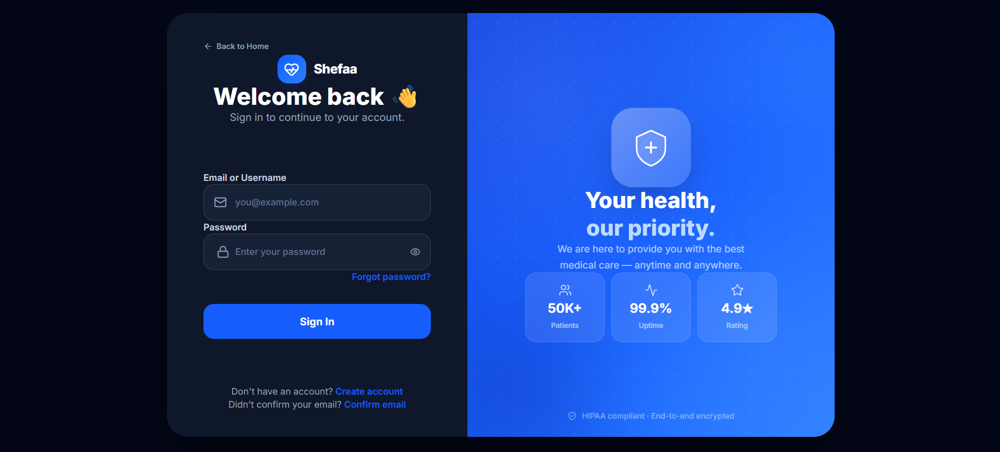
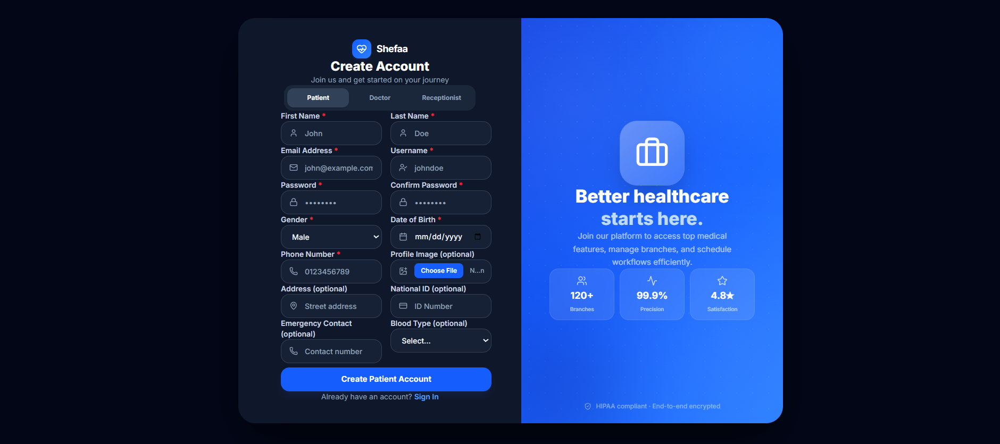
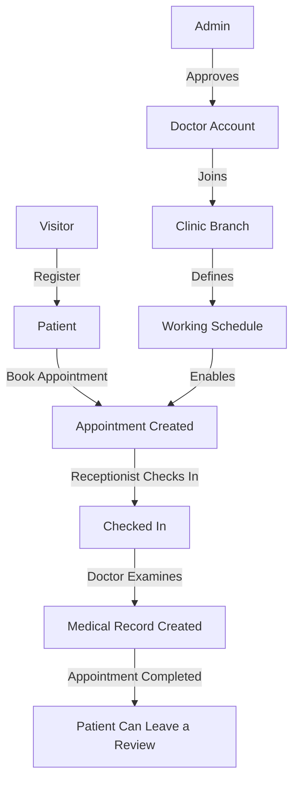

<div align="center">

# 🩺 Shefaa (شفاء)

### A Multi-Role Healthcare Appointment & Clinic Management Platform

Connecting patients, doctors, receptionists, and clinic administrators in one seamless system.

[](https://dotnet.microsoft.com/)
[](https://react.dev/)
[](https://www.typescriptlang.org/)
[](https://www.microsoft.com/sql-server)
[](#license)

</div>

---

## 📖 About The Project

**Shefaa** ("Healing" in Arabic) is a full-stack healthcare management platform built to digitize the entire patient journey — from discovering a doctor and booking an appointment, to being checked in at a clinic, examined, and having a medical record created, all the way through to leaving a review.

The platform is designed around **four distinct roles**, each with a tailored experience:

| Role | What they can do |
|---|---|
| 🧑‍⚕️ **Patient** | Browse doctors and specializations publicly, register, book/cancel/reschedule appointments, view their personal medical history, leave reviews for doctors they've visited |
| 🩺 **Doctor** | Join one or more clinic branches, define working hours and appointment slots per branch, view their daily patient queue, and write diagnoses, treatment plans, and medical records after a consultation |
| 💁 **Receptionist** | Manage the front desk for their assigned branch — check patients in on arrival, mark no-shows, and keep the day's schedule running smoothly |
| 🛡️ **Admin** | Full oversight of the platform: manage organizations, branches, specializations, doctor approvals, staff accounts, and view system-wide analytics on a dashboard |

The system enforces **branch-based scheduling** — a doctor must be affiliated with a branch before they can define availability there, and every appointment is tied to a specific doctor, branch, date, and time slot, giving patients full clarity on *where* and *when* they're being seen.

---

## ✨ Key Features

- 🔐 **Secure Authentication** — JWT-based auth with ASP.NET Core Identity, email confirmation, and OTP verification flows
- 🏢 **Multi-Organization Support** — Organizations own multiple branches, each with its own address, contact info, and staff
- 📅 **Appointment Lifecycle** — Book, cancel, and reschedule, with server-side validation to prevent double-booking
- 🗓️ **Doctor Schedule Management** — Per-branch working hours, configurable slot duration, and max-patients-per-slot
- 📋 **Digital Medical Records** — Chief complaint, diagnosis, treatment plan, doctor notes, and follow-up dates, viewable by the patient afterward
- ⭐ **Reviews & Ratings** — Patients rate completed appointments; a doctor's average rating updates automatically
- 🖥️ **Role-Aware Navigation** — Each role sees only the pages, menu items, and data relevant to them, both in the UI and enforced server-side
- 📊 **Admin Analytics Dashboard** — Live counters, appointment status charts, and top-specialization breakdowns
- 📖 **Interactive API Documentation** — Built-in OpenAPI spec with a [Scalar](https://scalar.com/) UI for exploring and testing endpoints

---
## 📸 Screenshots

### Home Page


### Doctors


### Login


### Register


### Patient Booking Flow


### My Appointments


### Admin Dashboard

---
## 🛠️ Tech Stack

### Backend
- **ASP.NET Core 10 (Web API)** — REST API with area-based routing per role
- **Entity Framework Core** — Code-first ORM against **SQL Server**
- **ASP.NET Core Identity + JWT Bearer Authentication** — role-based authorization
- **Mapster** — lightweight object-to-object mapping between entities and DTOs
- **Stripe.NET** — payment processing integration
- **Scalar + Microsoft.AspNetCore.OpenApi** — interactive API reference

### Frontend
- **React 19 + TypeScript** — component-driven SPA
- **Vite** — build tooling and dev server
- **TanStack Query (React Query)** — server-state management and caching
- **React Router v7** — client-side routing with role-based route protection
- **React Hook Form + Zod** — type-safe form handling and validation
- **Tailwind CSS v4 + Ant Design** — styling and UI components
- **Axios** — HTTP client with centralized interceptors for auth and error handling

---

## 🏗️ Architecture Overview

```
Shefaa/
├── Backend/
│   └── Shefaa/
│       ├── Areas/
│       │   ├── Admin/            # Org/branch/specialization/staff management, analytics
│       │   ├── DoctorArea/       # Doctor clinic membership, scheduling, medical records
│       │   ├── Identity/         # Registration, login, email confirmation, OTP
│       │   ├── Patient/          # Booking, personal appointments, reviews, medical history
│       │   └── Receptionist/     # Front-desk check-in / no-show workflow
│       ├── Models/                # EF Core entities
│       ├── DTOs/                  # Request/response contracts per feature
│       ├── Repositories/          # Generic repository pattern over EF Core
│       ├── Services/              # Business logic (file uploads, JWT, doctor ratings, email)
│       └── Program.cs             # App composition: DI, middleware pipeline, auth setup
│
└── Frontend/
    └── src/
        ├── app/                   # Router, providers (auth, query, theme)
        ├── features/              # Feature-first modules: pages, hooks, services, types, validation
        ├── components/            # Shared layout & UI primitives
        ├── api/                   # Axios instance and centralized endpoint registry
        └── config/                # Role-based navigation menu definitions
```

**Design principles followed:**
- **Role-based access is enforced twice** — once in the UI (route guards + conditional navigation) and again server-side (`[Authorize(Roles = ...)]`), so a hidden link is never the only thing standing between a user and unauthorized data.
- **Feature-first frontend structure** — each domain (`appointments`, `doctors`, `branches`, etc.) owns its full vertical slice: pages, hooks, API calls, types, and validation schemas.
- **Centralized error handling** — a global exception-handling middleware on the backend guarantees every unhandled error returns a consistent, safe JSON shape instead of leaking stack traces.

---

## 🚀 Getting Started

### Prerequisites
- [.NET 10 SDK](https://dotnet.microsoft.com/download)
- [Node.js](https://nodejs.org/) (v18+) and npm
- SQL Server (LocalDB, Express, or full instance)

### Backend Setup

```bash
cd Backend/Shefaa

# Configure your connection string and JWT settings in appsettings.json / appsettings.Development.json

dotnet restore
dotnet run
```

The API will be available at `https://localhost:7118`, with interactive docs at `/scalar`.

### Frontend Setup

```bash
cd Frontend

# Create a .env file with:
# VITE_API_BASE_URL=https://localhost:7118/api

npm install
npm run dev
```

The app will be available at `http://localhost:5173`.

---

## 👥 User Roles at a Glance



---

## 🤝 Contributing

This project was built collaboratively as a team effort. Contributions, issue reports, and suggestions are welcome — please open an issue or submit a pull request.

## 📄 License

This project is licensed under the MIT License.

---

<div align="center">

Built with ❤️ by the Shefaa Team

</div>
